# Project site link

http://54.180.119.166

# Banking and Chatbot System

# Language select

- In the upper right corner, you can choose the language.
- "画面右上から言語を選択することができます。"
- 우측 상단에서 언어를 선택하실 수 있습니다.

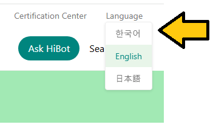

## 📌 Project Introduction

You can use AI chat bot and Banking System.

## 🚀 Main Functions

### 1. Chat Bot

- Click on 'Ask Hana Bot' in the upper right corner.
- Chat Bot will appear.

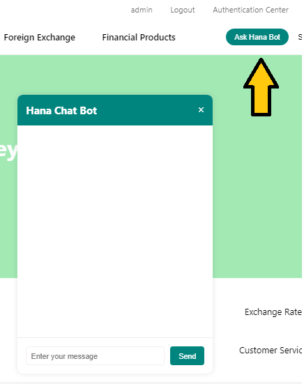

- Save chat history per user and provide continuous consultation service

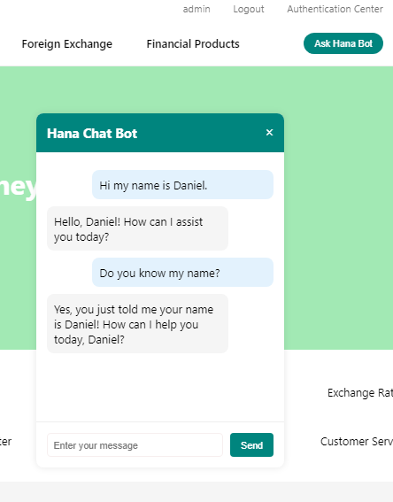

### 2. Foreign exchange rate

- Click on 'Exchange Rate' in main page.

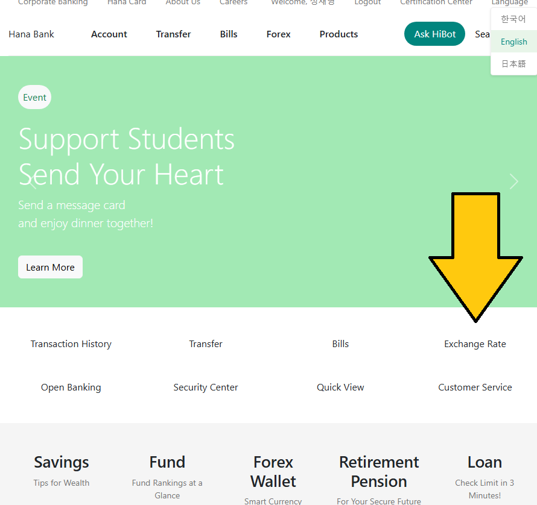

- You can move Exchange Rate information.
- It is conneted by API (Real-time information)

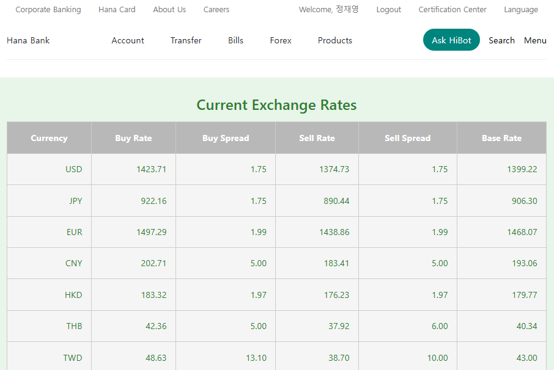

### 3. Banking (CRUD)

#### Create

- User registration process
- Automatic account creation upon registration

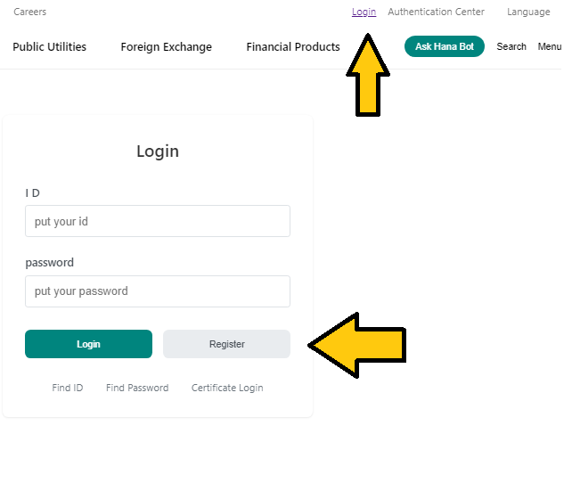

- option (if you write your Referrer, 2000 will added to Referrer's account)

#### Read

- Click "Account" in the upper left corner.
- Account inquiry function for logged-in users
- Restrict other users' account access for security

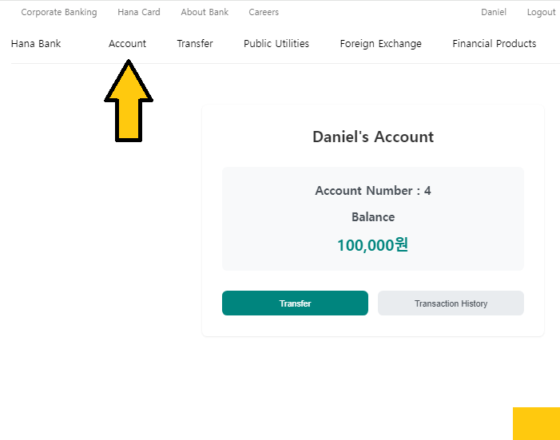

#### Update

- Click "Transfer" next to "Account"
- Account transfer system using SQL
- Real-time balance update function

- Account numbers are assigned in order of account creation.
  (if you first assign, your account number is "1")

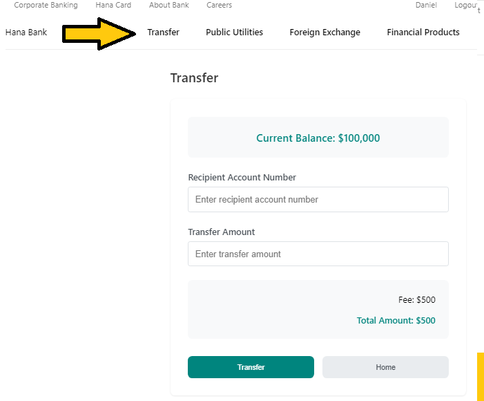

- if you click "Transaction History" on you can find change

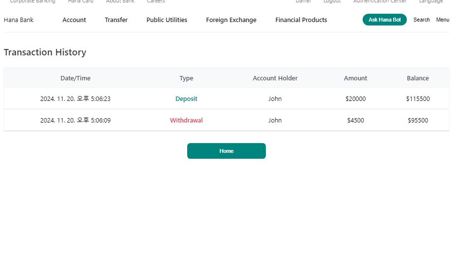

#### Delete

- Account deactivation function through admin account
- Block deposits and withdrawals for deactivated accounts

- You can access admin account by login (id : 0, pw : 0)

- You can enter admin page, when you click "Account Management"

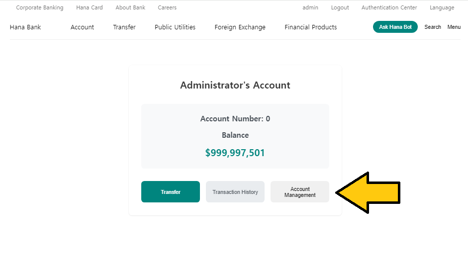

- You can choose which account to be deactivated.

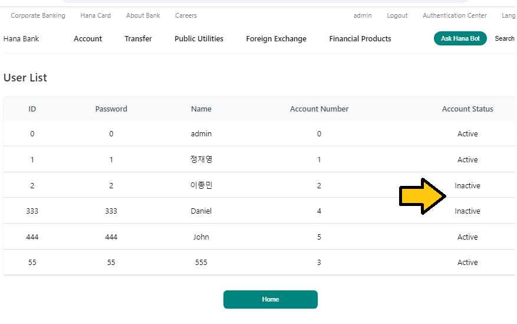

- That account can not be used

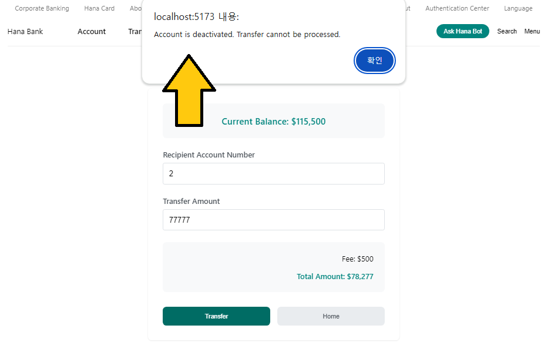

## 🛠 Tech Stack

### Frontend

- Vue.js

### Backend

- Spring Framework

### Database

- MySQL
- MyBatis (ORM)

### External API

- Chat GPT API
- Exchange Rate API

## 💻 System Architecture

Frontend (Vue.js) <-> Backend (Spring) <-> Database (MySQL)
↕
Chat GPT API
Exchange Rate API
